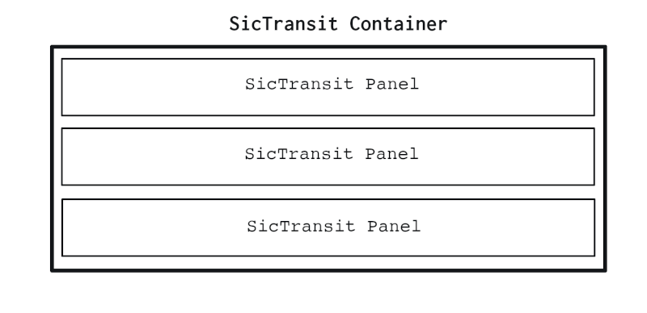

# SicTransit Documentation and Tutorial

This is the full documentation for the SicTransit library. It has live examples for all the public methods which can be run directly from this documentation.

SicTransit is [available on GitHub](https://github.com/pulpgrinder/sic-transit).

If you're looking for a basic example just to get started, have a look at the [minimal example](minimalexample.html).

## Installation

Add  `sic-transit.js` or `sic-transit-min.js` (minified) to your page, along with `sic-transit.css`. That's it!

## Initialization

Schematically, an instance of SicTransit is organized like this:



Basically, there's a container div which contains multiple panel divs. 

Setting up a new instance of SicTransit requires only two parameters, an id for the container div and a CSS class for the panels.

`const sicName = new SicTransit(containerId, panelClass);`

`containerId`: The ID of the container `div` that holds the panels.

`panelClass`: The user-specified class for the panels.

Put all your initial panel `divs` within your container `div`. Make sure each one has the given `panelClass` (you can add or remove panels later -- see below). If you've added more than one panel, the last panel in page order will be the panel shown at startup.

Example:

Set up a new instance of SicTransit named `demoSic`, associate it with a container `div` named `#democontainer`, and tell it that the nested panel `divs` in the container use the class `.demopanel`.

`const demoSic = new SicTransit("#democontainer", ".demopanel");`

This has already been done for you on this demo page. `demoSic` has been preloaded with `.demopanel` `divs` in the HTML markup for the page -- `#panel1` through `#panel4`.

The layout and content for these panels has intentionally been made very basic, to avoid distraction from the workings. In your own code, the panels can contain arbitrarily complex content (e.g., an entire screen for a mobile device). You should also set the CSS for your panels to (e.g.) make sure that the panels have the right size and so on for your application. Caveat: make sure to set a background color for your panels, or panels at lower levels of the stack may show through.

There's no problem having multple instances of SicTransit on the same page.

Later we'll see how to generate panels dynamically or turn preexisting `divs` elsewhere on the page into SicTransit panels and transfer them into a SicTransit container.

SicTransit does not have (or need) "teardown" or "destroy" methods -- instances of Sic 
 Transit are removed by the normal JavaScript garbage collection process when the last reference to them disappears.

## Public Methods

### `performTransition(args)`
Transitions are the heart of SicTransit. There are over 40 transitions described below.

#### `swipeInFromBottom, swipeOutToBottom, swipeInFromLeft, swipeOutToLeft, swipeInFromRight, swipeOutToRight, swipeInFromTop, swipeOutToTop`

Swipes are probably the most commonly used transition. The specified panel will appear (`swipeIn`) or disappear (`swipeOut`) from the specified edge of the container element, and will slide (or "swipe") across until it is fully visible (for `swipeIn`) or fully hidden (for `swipeOut`).

```javascript

// Swipe #panel1 in from the right, and make it the
// current visible panel.

demoSic.performTransition({panelSelector:"#panel1",transitionName:"swipeInFromRight"});
```

Note: in this documentation, green code (like the above) is live code. It can be run by switching to the demo screen with the Demo button, then run with the Run Demo button.

```javascript
// Swipe #panel1 out to the top, revealing the previous panel. Note that swiping out to a different direction than the swipe in is fine. In general, this applies to all SicTransit transtiions other than the menu transitions.

demoSic.performTransition({panelSelector:"#panel1",transitionName:"swipeOutToTop"});

```

You can edit the above code snippets and rerun them if you want to see the other swipe transitions.

#### `cutIn/cutOut` 

These transitions make the change immediately, without any animation effects (like a movie cut).

```javascript
// Move "#panel2" to the top of the stack
// and display it immediately.

demoSic.performTransition({panelSelector:"#panel2",transitionName:"cutIn"});
```

```javascript
// Move "#panel2" to the bottom of the stack
// and hide it immediately.The panel previously
// one down from the top of the stack will become
// visible.

demoSic.performTransition({panelSelector:"#panel2",transitionName:"cutOut"});
```

#### `crossDissolveIn/crossDissolveOut` 

These transitions fade in one panel, while simultaneously fading out another.

```javascript
// Move "#panel1" to the top of the stack and 
// gradually fade it in, while fading out the 
// panel which was the previous top of the stack.

demoSic.performTransition({panelSelector:"#panel1",transitionName:"crossDissolveIn"});
```

```javascript
// Gradually fade out "#panel1", while fading
// in the panel underneath it on the stack.

demoSic.performTransition({panelSelector:"#panel1",transitionName:"crossDissolveOut"});
```

#### `fadeInFromBlack, fadeInFromGray, fadeInFromWhite, fadeOutToBlack, fadeOutToGray, fadeOutToWhite`

Fade transitions gradually fade the specified panel in or out from a solid color background.

There are six fade transitions,  a `fadeInFrom` and a `fadeOutTo` each for white, black, and gray.


```javascript
// Gradually fade #panel3 in from a solid black
// background panel.

demoSic.performTransition({panelSelector:"#panel3",transitionName:"fadeInFromBlack"});
```

```javascript
// Gradually fade "#panel3" out,
// leaving a solid gray background panel.

demoSic.performTransition({panelSelector:"#panel3",transitionName:"fadeOutToGray"})
```

As always, you can edit the above code snippets and rerun them if you want to see the other fade transitions.

#### `irisIn/irisOut, irisInFrom/irisOutTo`

These transitions use growing or shrinking circles through which the panel in question is visible (similar to a "camera iris" effect). `irisIn` and `irisOut` work with whatever elements are already on the stack, while `irisInFromWhite`, `irisOutToWhite`, `irisInFromBlack`, `irisOutToBlack`, `irisInFromGray`, and `irisOutToGray` use panels of the specified color for the iris surround.

```javascript
// Move "#panel3" to the top of the stack and
// gradually display it using an iris effect. 
// The iris surround will be whichever panel was 
// previously on top of the stack.

demoSic.performTransition({panelSelector:"#panel3",transitionName:"irisIn"});
```


```javascript
// Hide "#panel3" using an iris effect.

demoSic.performTransition({panelSelector:"#panel3",transitionName:"irisOut"});
```


```javascript
// Iris "#panel3" in from a white background.
demoSic.performTransition({panelSelector:"#panel3",transitionName:"irisInFromWhite"});
```

```javascript
// Iris "#panel3" out to a black background.
demoSic.performTransition({panelSelector:"#panel3",transitionName:"irisOutToBlack"});
```


#### menuInFromBottom, menuOutToBottom,menuInFromLeft, menuOutToLeft,menuInFromRight, menuOutToRight,menuInFromTop, menuOutToTop

The `menuInFrom/menuOutTo` transitions do a "partial swipe" (see the swipe transitions above), sliding the specified panel in/out from/to the specified direction only partially. This is useful for making sliding menus. Valid directions are Left, Right, Top, and Bottom. The default menu coverage varies depending on the direction. This can be changed with `setParameter()` (see below). Examples: 

```javascript
// Display "#menupanel" as a menu on the right 
// side of the panel container.

demoSic.performTransition({panelSelector:"#menupaneltest",transitionName:"menuInFromRight"});
```

```javascript
// Hide the previous "#menupanel" menu.

demoSic.performTransition({panelSelector:"#menupaneltest",transitionName:"menuOutToRight"});
```

```javascript
// Display "#menupanel" as a menu on the top 
// side of the panel container.

demoSic.performTransition({panelSelector:"#menupaneltest",transitionName:"menuInFromTop"});
```

```javascript
// Hide the previous "#menupanel" menu.

demoSic.performTransition({panelSelector:"#menupaneltest",transitionName:"menuOutToTop"});
```
 As usual, you can edit the code above to experiment with other menu transitions. 

*Unlike most transitions, using `menuIn` from one direction and `menuOut` to another, while not causing an error, will produce an odd visual effect that you probably don't want*.

The CSS for basic menus is minimal. This demo has some extra CSS to add some visual interest (see `sic-demo.css`) You're welcome to use your own CSS to make the menus look like you want them to.

A SicTransit menu has this basic form:

```html
    <div id="(menupanel id)" class="(Sic Transit panel class">
        <div class="sic-transit-menucontainer">
            <div class="sic-transit-menuitem">
                Menu Item 1
            </div>
            <div class="sic-transit-menuitem">
                Menu Item 2
            </div>
            <div class="sic-transit-menuitem">
                Menu Item 3
            </div>
            <div class="sic-transit-menuitem">
                Menu Item 4
            </div>
        </div>
    </div>
```

As noted above, you're welcome to apply your own CSS to style `sic-transit-menucontainer` and `sic-transit-menuitem`.

#### hingeInFromTop, hingeOutToTop, hingeInFromBottom, hingeOutToBottom, hingeInFromLeft, hingeOutToLeft, hingeInFromRight, hingeOutToRight

These transitions have the visual effect of a "hinge" on the specified side (like a door or a book opening).

```javascript
// Hinge "#panel2" in from the left side.
demoSic.performTransition({panelSelector:"#panel2",transitionName:"hingeInFromLeft"});
```

```javascript
// Hinge "#panel2" out to the top.
demoSic.performTransition({panelSelector:"#panel2",transitionName:"hingeOutToTop"});
```

Edit the code samples above to see the hinge effect applied to different sides.


#### spinIn, spinOut

These transitions provide a "spinning newspaper" effect, as seen in many old movies. 
`spinIn` makes the selected panel grow and rotate as it appears, while `spinOut` reverses the process.

```javascript
// Transition panel "#panel2" in, using the 
// spinning newspaper effect

demoSic.performTransition({panelSelector:"#panel2",transitionName:"spinIn"});

```

```javascript
// Transition panel "#panel2" out, using the
// spinning newspaper effect

demoSic.performTransition({panelSelector:"#panel2",transitionName:"spinOut"});

```

#### rotateStack

The `rotateStack` transition takes an integer parameter, denoted by `stackRotationNumber`, and either pulls panels from the top of the stack and puts them on the bottom (positive integers) or pulls panels from the bottom of the stack and puts them on top (negative integers). `rotateStack` does *not* use a `panelSelector` parameter. If a `panelSelector` argument is supplied, it will be ignored. If the `stackRotationNumber` is not supplied, it is assumed to be 1. 

This is handy if you want to remove several elements from the stack at once, in the reverse order of how they were added. For example, suppose you display a menu, then from that display a submenu (and possibly sub-sub-menus, etc.) `rotateStack` would allow you to "unwind" the stack of menus and get back to the original display without removing them explicitly.

`demoSic.performTransition({transitionName:"rotateStack",stackRotationNumber:3});`
(panel that was third from the top of the stack is now on top).

```

#### `swap`

The `swap` transition reverses the top two entries on the panel stack. For example, if `#panel4` is on top of the stack and `#panel1` is immediately underneath it, after a `swap` transition is executed `#panel1` will be on top with `#panel4` underneath it. This transition does not take any parameters other than the transition name. Example:


```javascript
// Reverse the order of the top two elements on the panel stack.

demoSic.performTransition({transitionName:"swap"})
```


#### `zoomIn/zoomOut`

These transitions provide a "zoom lens" effect. `zoomIn` causes the selected panel to grow from the center of the container until it reaches full size, while `zoomOut` causes the selected panel to shrink to the center until it disappears.

```javascript
// Use a zoom transition to display #panel4
demoSic.performTransition({panelSelector:"#panel4",transitionName:"zoomIn"});
```

```javascript
// Use a zoom transition to hide #panel4
demoSic.performTransition({panelSelector:"#panel4",transitionName:"zoomOut"});

```

### Other public methods

#### `getBos()`
Returns whatever panel is currently at the bottom of the instance's panel stack as an HTML element.


#### `getTos()`
Returns whatever panel is currently at the top of the instance's panel stack as an HTML element.

#### `getContainerId()`
Returns the user-specified ID that was given for the panel container when the instance was created. Returns '#democontainer' for this page.

#### `getPanelClass()`
Returns the user-specified CSS class that was given when the instance was created. Returns '.demopanel' for this page.

#### `getPanelList()`
Returns an array of the ids of user-created panels within the panel container, whether there initially or added later. Panels that don't have ids won't be included, nor will the special internal panels (black, white, gray, etc.) that are used in certain transitions.

#### `getTransitionList()`
Returns an array containing the names of all defined transitions, more than 40 at present.

#### `getZIndex(selector)`
Returns the current z-index for the selected panel. The visible panel at the top of the stack always has z-index 0. The panels below it have indices of -1, -2, -3... counting down from the top of the stack.

#### `moveToBos(selector)`
Moves the selected panel to the bottom of the stack.

#### `moveToTos(selector)`
Moves the selected panel to the top of the stack.

#### `setParameter(parametername, parametervalue,transitionname)`
Sets the given parameter name to the given value for the given transition name. If the transition name is "\*" (in quotes), or not supplied, the specified parameter is set for *all* transitions.

Some commonly used parameters include:

`duration` -- set the duration of the transition in milliseconds. Default value varies, depending on the transition (some transitions look better slower, others faster).

`callback` -- sets a user-written function that is called when the transition is complete. Default is null.

`menuSize` -- controls the size of menu panels (i.e., the amount by which the underlying panel gets covered by the menu). Measured in ems. Only relevant for the "menu-" transitions (see above), though it will not cause an error if you set it for other transitions. It will simply have no effect. Default is 12 em for side menus, 3 em for top and bottom menus.

There are other parameters that might be of interest to advanced users, in particular those defining their own custom transtitions. See the `dispatchTable` object in `sic-transit.js` to learn more.

Examples:

##### Duration
`demoSic.setParameter("duration",3000,"swipeInFromLeft");` -- sets the duration for the `swipeInFromLeft` transition to 3000 milliseconds (3 seconds) rather than the default 500 ms.

##### menuSize

`demoSic.setParameter("menuSize",10,"menuInFromRight");`
`demoSic.setParameter("menuPercentage",10,"menuInFromRight");`

These set the coverage for the right-side menu transitions to 10 em rather than the default 12 em.. Note that in most cases you should set the menuIn and menuOut menuSize to the same value. Having different values will not cause an error, but will produce odd effects that you probably don't want in other than very special circumstances.


##### Callbacks

The `setParameter` method can also be used to set a callback method that will be called whenever a transition is complete.

Examples:

Suppose we have a callback function like this:

    function myCallBackFunc(args){
        alert("Hello from swipeInFromLeft");
    }

We can have this function called whenever a `swipeInFromLeft` transition is completed by using:

    demoSic.setParameter("callback",myCallBackFunc,"swipeInFromLeft");


We can also set a callback function for **all** transitions. If our function is:

    function anotherCallBackFunc(args){
        alert("Hello from " + args.transitionName);
    }

We'd use:

    demoSic.setParameter("callback",anotherCallBackFunc,"*");


Note the use of args.transitionName in `anotherCallBackFunc()` The args object passed to a callback has the following data available for your use:

    args.transitionName
    args.startTime
    args.endTime
    args.panelSelector
    args.selectedPanel
    args.stackRotationNumber (only valid for the `rotateStack` transition)

Future transitions may define other key/value pairs on the args object.
    
Most of these are self-explanatory. The difference between `panelSelector` and `selectedPanel` is that the first is the selector provided by the user and the second is the HTML element that was actually selected using that selector.


#### `removePanel(selector)`

Removes the panel with the given selector from the SicTransit instance. Returns the panel as an HTML element. If you wish, you can retain the panel and put it elsewhere in the DOM and/or add it back to the SicTransit instance at a later time. Generally, though, you'd only use this if you want to get rid of the panel permanently. If you just want to make the panel disappear, it would be more efficient to move it to the bottom of the stack (`moveToBos()`) or use one of the "transitionOut" transitions.


#### `showPanel(selector)`
Make the selected `div` a SicTransit panel, move it to the top of the stack and display it immediately. The div can already be within this instance, in another instance of SicTransit, or even at an arbitrary place in the page DOM. The special CSS classes for SicTransit will be added automatically, if needed, but you may need to do some custom CSS tweaking to make arbitrary DOM `divs` work (e.g., if the imported DOM element has some kind of CSS sizing or positioning that makes it incompatible with being a SicTransit panel).

Example:

    demoSic.showPanel("#mycoolpanel");

#### `stackDump()`
Prints the current state of the panel stack to the console. This is handy if you are debugging a new transition.
Example:

    demoSic.stackDump();

#### `transferPanel(selector)`

Transfers a panel from the DOM (or another instance of SicTransit) into this one. The difference between this and `showPanel()`, above, is that `transferPanel()` does not automatically display the panel, while `showPanel()` does. In fact, `showPanel()` works by first calling `transferPanel()` and then moving the transferred panel to the top of the stack. 

Example:

    demoSic.transferPanel("#mycoolpanel");


## More on Selectors

Many of the SicTransit public methods have a selector argument to specify a particular panel. Usually this is the id for the panel, but there are many other options.

The examples below use `showPanel()` for simplicity, but these selector types below apply to any method that requires selecting a panel (for example, the `panelSelector` parameter in `performTransition`).

A SicTransit selector can be any of the following types:

### String 
Strings as normal query selectors, with the same basic syntax as `document.querySelector()` and CSS. This is the most common type. SicTransit actually uses `document.querySelector()` under the hood here, so the selectors can get as fancy as you need them to be.


### Integer
Integers are intepreted as numeric indices into the internal panel stack. A negative integer denotes an offset from the top of the stack, while a non-negative integer (i.e., including zero) indicates an offset from the bottom of the stack.

Examples:

Use an integer value to move the panel one up from the bottom of the demoSic stack to the top of the stack and display it.

    demoSic.showPanel(1);

Use an integer value to move the panel one down from the top of the demoSic stack to the top of the stack and display it.

    demoSic.showPanel(-1);


### Dom Element
An explicit DOM element. This form is mostly  used for internal SicTransit operations, but it's there if you need it. The special classes required for a SicTransit panel will be added automatically. This exampl

Example:

    const newpanel =  document.createElement('div');
    newpanel.innerHTML = "<h1>Hi, there!</h1>";
    demoSic.showPanel(newpanel);

This is a bare-bones example. You'll likely need to add some CSS to your dymamically generated panel to make it work right. In particular, make sure it has a background color, as noted above. Depending on how your other CSS is set up, you may also need to use some CSS to make sure it's the same size as the other panel.
